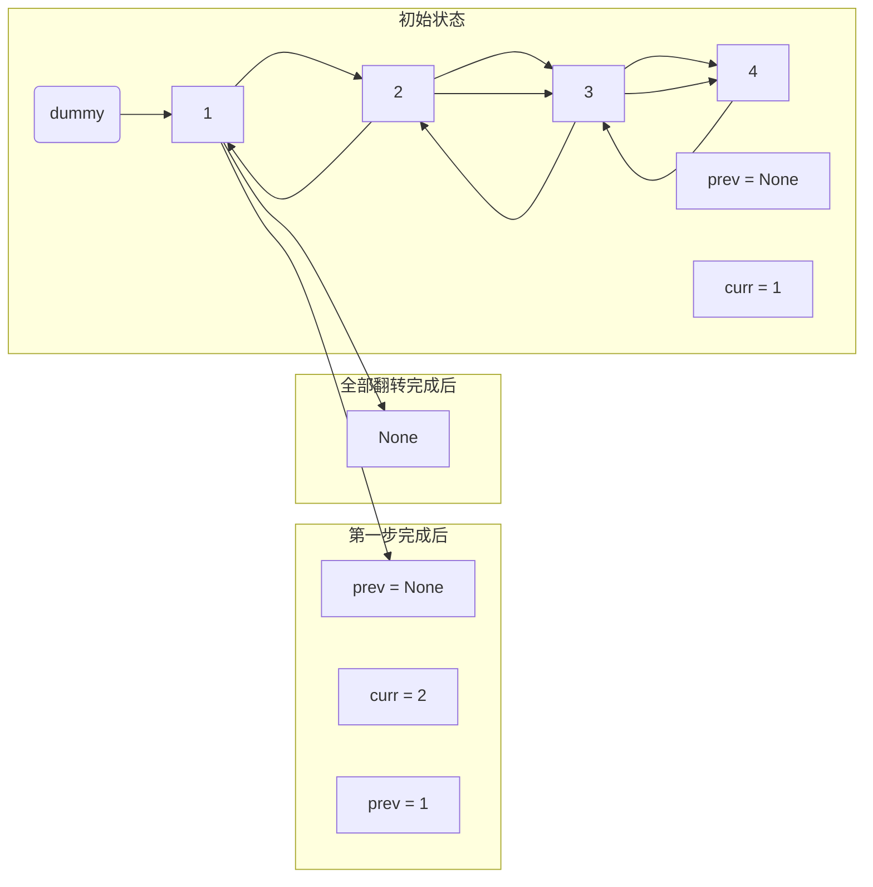

# 反转单链表：核心逻辑与图解

反转单链表是解决 "K 个一组翻转" 或 "两两翻转" 等复杂问题的基础。

## 1. 核心思想：迭代翻转 (Iterative)

核心逻辑是使用三个指针：
- `prev`: 指向当前节点的前一个节点。
- `curr`: 指向当前正在处理的节点。
- `next`: 临时存储 `curr` 的下一个节点，防止断链。

### 反转的每一步逻辑：
1. **保存下个节点**: `next_node = curr.next` (我们要记住后面是谁)
2. **反转指针**: `curr.next = prev` (让现在的节点指向它的前面)
3. **整体后移**:
   - `prev = curr` (前一个位置挪到当前位置)
   - `curr = next_node` (当前位置挪到刚才保存的下一个位置)

---

## 2. 过程图解 (Mermaid)

假设链表为 `1 -> 2 -> 3 -> 4`:



### 动态示意图演示:
以下是循环过程中的指针变换：

```text
Step 0 (Initial): [None] (prev)  [1] (curr) -> 2 -> 3 -> 4
Step 1:           [1] (prev) -> [None]      [2] (curr) -> 3 -> 4
Step 2:           [2] -> 1 -> None          [3] (curr) -> 4
Step 3:           [3] -> 2 -> 1 -> None     [4] (curr) -> None
Step 4 (End):     [4] -> 3 -> 2 -> 1 -> None (prev)
```

---

## 3. 代码实现 (带详细注释)

参见同目录下的 `reverse_list_step_by_step.py` 文件。
